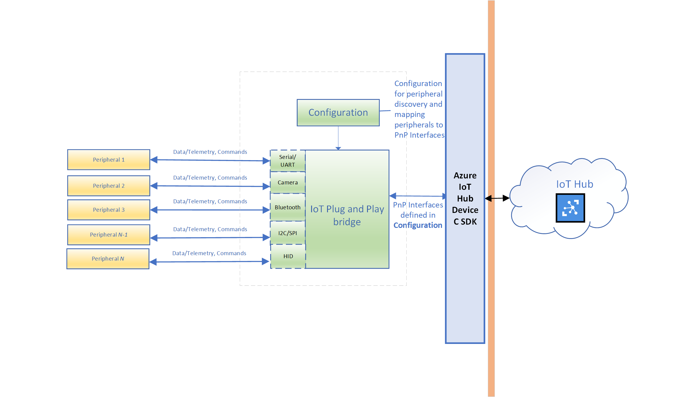

# Azure IoT Plug and Play bridge

## Introduction
Azure IoT Plug and Play bridge is the open source effort from Microsoft that connects the PC sensor and peripheral ecosystem to Azure. It builds on top of [Azure IoT Plug and Play](https://azure.microsoft.com/en-us/blog/iot-plug-and-play-is-now-available-in-preview/) so that with minimal to no code, developers can easily connect peripherals to Azure, remotely access their data, monitor them, and manage them. This allows developers to perform analytics and gain valuable insights on their IoT devices from either the edge or the cloud. The Azure IoT Plug and Play bridge accomplishes this without requiring peripherals to have direct Azure connectivity, enabling them to use a Windows or Linux host as a gateway to Azure instead. Because of this, it is particularly well suited for connecting cameras and environmental sensors to Azure.

Azure IoT Plug and Play bridge can be deployed as a standalone executable on any IoT device, PC, industrial PC, server, or gateway running Windows 10 or Linux. It can also be compiled into your application code. A simple configuration file tells the Azure IoT Plug and Play bridge which sensors and peripherals should be exposed up to Azure. Once configured, the Azure IoT Plug and Play bridge uses the Azure IoT PnP SDK to dynamically publish Azure IoT PnP interfaces for the specified sensors and peripherals up to Azure. Developers can then use existing Azure services and solution accelerators to receive data from and send commands to their sensors and peripherals. 

## Pre-Requisites
- For Windows 10 OS:
  - For Camera health monitoring functionality, current Insider Preview OS version is required.
    - All other functionality is available on all Windows 10 builds. 
  - All Windows SKUs are supported. For example:
    - Windows IoT Enterprise
    - Windows Server
    - Windows Desktop
    - Windows IoT Core
- For Linux:
  - Ubuntu is supported
- Hardware:
  - Any hardware platform capable of supporting the above OS SKUs and versions.
  - Serial, USB, and Camera peripherals are supported natively. The Azure IoT Plug and Play Bridge can be extended to support any custom peripheral ([see peripherals section below](#peripherals-supported-by-default)) 

- Public Preview of [Azure IoT SDK for C](https://github.com/Azure/azure-iot-sdk-c/tree/public-preview). The included build scripts will automatically clone the required Azure IoT PnP C SDK for you.

- Public Preview of [Azure IoT Central](https://docs.microsoft.com/en-us/azure/iot-central/overview-iot-central-pnp) (Optional, a fully-managed IoT SaaS solution with UI that can be used to monitor and manage your device from Azure)

- Optional: [Azure IoT Edge](https://docs.microsoft.com/en-us/azure/iot-edge/) (can be used to help deploy, run, and manage software on the device)

## Azure IoT Plug and Play bridge Architecture

## Peripherals supported by default

Azure IoT Plug and Play bridge supports the following types of peripherals by default. Developers can extend the Azure PnP Bridge to support additional peripherals via the instructions in the [PnP Bridge documentation](./pnpbridge/ReadMe.md).
- Peripherals controlled by MCUs that are accessed over serial ports:
    - Refer to the [SerialPnP documentation](./serialpnp/Readme.md) for information on how such devices should self-describe their interfaces to the PnP Bridge
- USB peripherals that can be discovered by Windows
- All cameras supported by Windows OS (Webcam, MIPI cameras and IP of RGB/IR/Depth cameras).

## Get Started

Follow [pnpbridge\Readme.md](./pnpbridge/ReadMe.md) to get started on building, deploying and extending the PnP Bridge.

## Contributing
This project has adopted the [Microsoft Open Source Code of Conduct](https://opensource.microsoft.com/codeofconduct/). For more information see the [Code of Conduct FAQ](https://opensource.microsoft.com/codeofconduct/faq/) or contact [opencode@microsoft.com](mailto:opencode@microsoft.com) with any additional questions or comments.

Microsoft collects performance and usage information which may be used to provide and improve Microsoft products and services and enhance your experience.  To learn more, review the [privacy statement](https://go.microsoft.com/fwlink/?LinkId=521839&clcid=0x409).  

