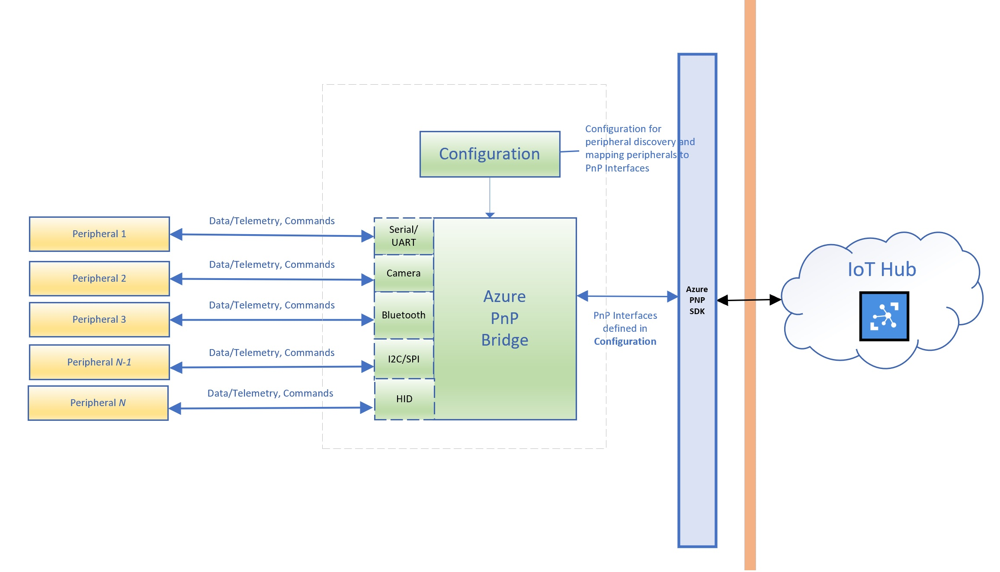

# Azure PnP Bridge

## Introduction
Azure PnP Bridge is the open source effort from Microsoft to bridge the PC sensor and peripheral ecosystem with Azure so that IoT developers can easily connect, remotely monitor, and remotely manage their IoT sensors and peripherals on a large scale. By bridging IoT sensors and peripherals with Azure, the Azure PnP Bridge also enables developers to perform data analytics from either the edge or the cloud to gain insights on their IoT devices.

Azure PnP Bridge is a standalone executable that can be dropped onto any IoT device, PC, or gateway running Windows 10. A simple configuration file tells the Azure PnP Bridge which sensors and peripherals should be exposed up to Azure. Once configured, the Azure PnP Bridge uses the Azure IoT PnP SDK to dynamically publish Azure IoT PnP interfaces for the specified sensors and peripherals up to Azure. Developers can then use existing Azure services and solution accelerators to receive data from and send commands to their sensors and peripherals. 


## <a id="pre-requisites"></a>Pre-Requisites
- Windows 10 OS:
  - For Serial, HIDUSB devices, OS version 1809 or newer is required
  - For Camera monitoring functionality, current Insider Preview OS version is required.
  - One of the following OS flavors:
    - Windows IoT Enterprise
    - Windows Server
    - Windows Desktop SKU
    - Windows IoT Core (if no camera monitoring is needed)

- Hardware:
  - Any hardware capable supporting above OS SKUs and versions.
  - [Supported peripherals (see section below)](#peripherals)

- Private Preview of Azure IoT Central at https://aka.ms/iotc-demo.

- IoT Edge (optional, can be used to help deploy, run, and manage software on the device)

## Azure PnP Bridge Architecture


## Using the Azure PnP Bridge

### Development Pre-Requisite
- In order to build Private Preview Azure PnP Bridge, you need to have access to Azure IoT PnP Preview at https://github.com/azure/azure-iot-pnp-preview. 

- Ensure cmake and Visual Studio 2017 are installed

- Download Windows 17763 SDK: https://developer.microsoft.com/en-US/windows/downloads/windows-10-sdk


### Building the Azure PnP Bridge
#### Step 1: Get the required dependencies for the Azure PnP Bridge
After cloning the Azure PnP Bridge repo to your machine, open the "Developer Command Prompt for VS 2017" and navigate to the directory of the cloned repo:
```
%REPO_DIR%\> cd PnpBridge

%REPO_DIR%\PnpBridge\> git submodule update --init --recursive
```

At this step, if you confirmed you have access to the Azure repo but are not able to successfully clone the required repos, you might be hitting authentication issues. To resolve this, install the [Git Credential Manager for Windows](https://github.com/Microsoft/Git-Credential-Manager-for-Windows/releases)

#### Step 2: Build the prerequisite components for the Azure PnP Bridge
```
%REPO_DIR%\> cd PnpBridge\Scripts

%REPO_DIR%\PnpBridge\Scripts\> build.prereq.cmd
```

#### Step 3: Build the Azure PnP Bridge

1. Open `PnpBridge\src\PnpBridge\PnpBridge.vcxproj` with "Visual Studio 2017"
2. Ensure build target matches the build.prereq.cmd's build (e.g. Release|Debug and x86|x64)
3. Build the solution
4. The built `Pnpbridge.exe` is the Azure PnP Bridge binary

### <a id="peripherals"></a>Supported Peripherals 

Azure PnP Bridge comes with set of supported peripherals:
- Peripherals connected over Serial COM ports or Serial over USB
    - Please refer to the Serial Device Readme found in the `SerialPnP` folder for how Serial Devices can self-describe their interfaces to the Azure PnP Bridge
- USB HID peripherals
- All cameras supported by Windows OS (Webcam, MIPI cameras and IP of RGB/IR/Depth cameras).

For serial/USB peripheral devices that are not included in current source code, developers can update the Azure PnP Bridge code to enable their custom protocols.

### Deploying the Azure PnP Bridge

1. Set up an IoT Central Dashboard
  - https://docs.microsoft.com/en-us/azure/iot-central/tutorial-define-device-type 

2. Setup a device and get the Connection String to connect the device to IoT Central.  This device is the Azure PnP Bridge Device. 
  - https://docs.microsoft.com/en-us/azure/iot-central/tutorial-add-device

3. Setup Azure PnP Bridge Device
    - Refer to the [Pre-Requisites](#pre-requisites) section for choosing which OS image to install on the device. 
    - In the `src/pnpbridge/config.json` file, update the `ConnectionString` under `PnpBridgeParameters` with the Connection String from Step #2.  
    - copy `pnpbridge.exe` and `src/pnpbridge/config.json` in the same location on the Azure PnP Bridge Device.
    - In a command line window, type `pnpbridge.exe`.  This will start the Azure PnP Bridge process.  

## Contributing
This project welcomes contributions and suggestions. Most contributions require you to agree to a Contributor License Agreement (CLA) declaring that you have the right to, and actually do, grant us the rights to use your contribution. For details, visit https://cla.microsoft.com.
When you submit a pull request, a CLA-bot will automatically determine whether you need to provide a CLA and decorate the PR appropriately (e.g., label, comment). Simply follow the instructions provided by the bot. You will only need to do this once across all repos using our CLA.
This project has adopted the Microsoft Open Source Code of Conduct. For more information see the Code of Conduct FAQ or contact opencode@microsoft.com with any additional questions or comments.
